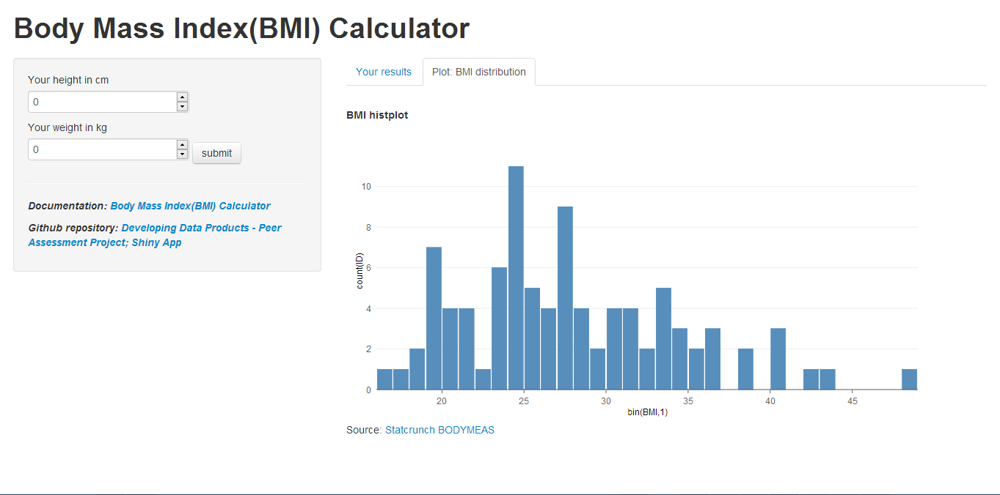
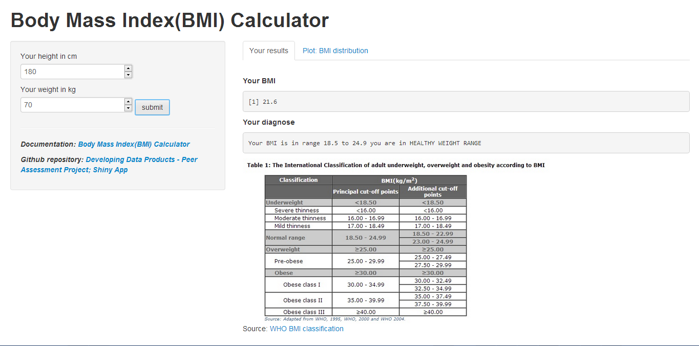

### Intro & Motivation

Body Mass Index (BMI) is a simple index of weight-for-height that is commonly used to classify underweight, overweight and obesity in adults. It is defined as the weight in kilograms divided by the square of the height in metres (kg/m2).  
Key facts:  
* Worldwide obesity has nearly doubled since 1980.  
* In 2008, more than 1.4 billion adults, 20 and older, were overweight. Of these over 200 million men and nearly 300 million women were obese.  
* 35% of adults aged 20 and over were overweight in 2008, and 11% were obese.  
* 65% of the world's population live in countries where overweight and obesity kills more people than underweight. More than 40 million children under the age of 5 were overweight or obese in 2012.  
* Obesity is preventable.[WHO Obesity and Overweight Factwheet](http://www.who.int/mediacentre/factsheets/fs311/en/)  
Good Nutrition and regular phisical activity are vital for good health and disease prevention. Overweight and obesity are serious and costly health problem worldwide; it's very important people to be informed and aware of overweight and obesity trends.

--- .class #id 

## Shiny App: BMIApp

    

   
[Body Mass Index(BMI) Calculator App Hosted by shinyapps.io](https://jjdblast.shinyapps.io/BMICAL/)  

---

## Features

Enter your weight, height and get informed!

    

   

*Plot: Calculate your results !
[Github Repository](https://github.com/jjdblast/Develop-Data-Product)

---

## Features

*Plot: Compare youself with the sample !*  
<iframe src=' assets/fig/unnamed-chunk-1.html ' scrolling='no' frameBorder='0' seamless class='rChart polycharts ' id=iframe- chart5e047e9874fa ></iframe> 

**THANK YOU !**

[My Github Repository](https://github.com/jjdblast/Develop-Data-Product) and
[My Shiny App](https://jjdblast.shinyapps.io/BMICAL/)
